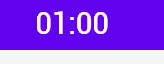
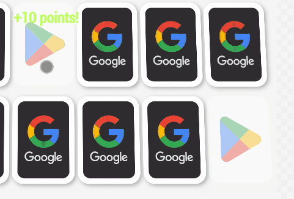

# React-based Memory Card Game

The purpose of developing this game from scratch was to build a ReactJS project that goes beyond the conventional usage of React and to showcase it as a portfolio.

## About the game

 This is base on the very known memory card game. It's a card game where players take turns flipping over two cards at a time with the goal of finding pairs of matching cards. The cards are initially placed face-down in a grid-like arrangement. On each turn, the player chooses two cards to flip over. If the two cards match, the player keeps the pair and goes again. If the two cards do not match, the player flips them back over and the next player takes their turn. The game continues until all pairs have been found. The player with the most pairs at the end of the game is the winner.

## Demonstration

 
 
 ## Highlights

### Intro animation

- Smoothing animation

### Timer formating

- add zero for number below zero.
- show only seconds when the timer is below 1 minute. 
  
  

### Flip card animation
  
  

### Points notificaion
  
  

